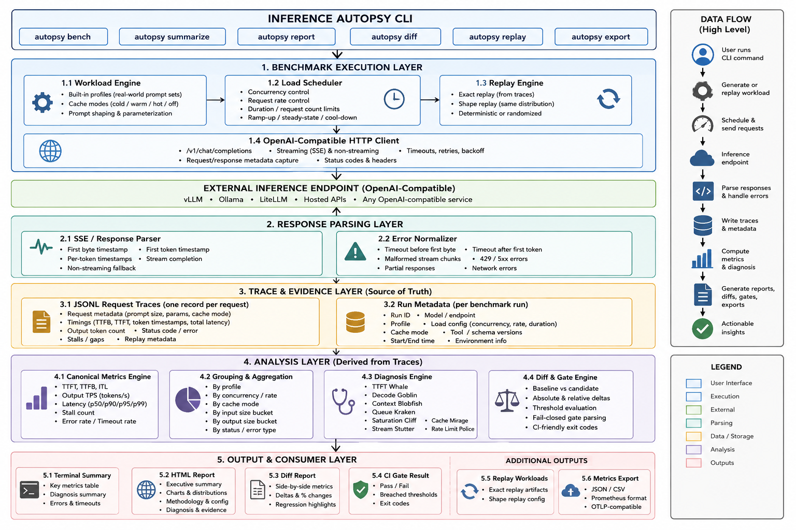

# Architecture

## Purpose

Define the target architecture and module boundaries.

## Reference When

Use before adding features, moving code, or introducing dependencies.

## AI Agents Must Obey

Keep transport, domain logic, persistence, metrics, diagnosis, and presentation
separate.

## Target Flow

```txt
Typer CLI
  -> application services
  -> workload runner
  -> OpenAI-compatible HTTP client
  -> streaming parser
  -> trace recorder
  -> metrics engine
  -> diagnosis engine
  -> report view model
  -> static report renderer
  -> diff and gate engine
  -> replay engine
```

## Layer Rules

- CLI layer parses arguments and formats terminal output.
- Application services coordinate use cases.
- HTTP client owns provider requests, timeouts, retries, and redaction.
- Streaming parser converts bytes/events into typed stream events.
- Trace recorder writes append-friendly JSONL records.
- Metrics engine computes canonical metrics from traces.
- Diagnosis engine maps metrics to explainable causes.
- Report renderer displays prepared data; it does not compute canonical metrics.
- Diff engine compares runs and evaluates gates.
- Replay engine preserves workload shape while allowing endpoint substitution.

## Boundary Rules

- Inner domain logic must not import CLI or report code.
- Metrics must not depend on HTML rendering libraries.
- Report code must not make network calls.
- Replay must not mutate original trace files.
- Schema changes require versioning and documentation.

## Acceptable Architecture Changes

Architecture changes require a short RFC when they:

- Add a new layer.
- Change trace schema.
- Replace core dependencies.
- Change concurrency model.
- Introduce persistence beyond files.
- Add a hosted service assumption.

# High Level Software Architecture


